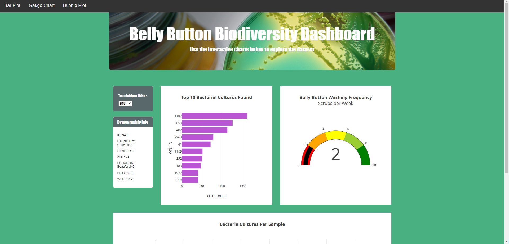
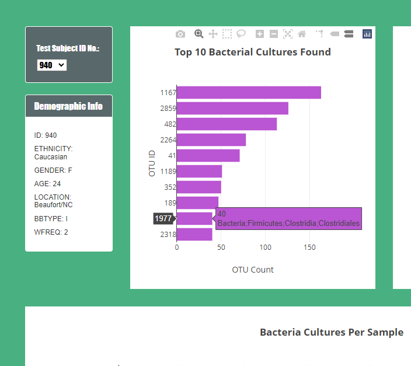
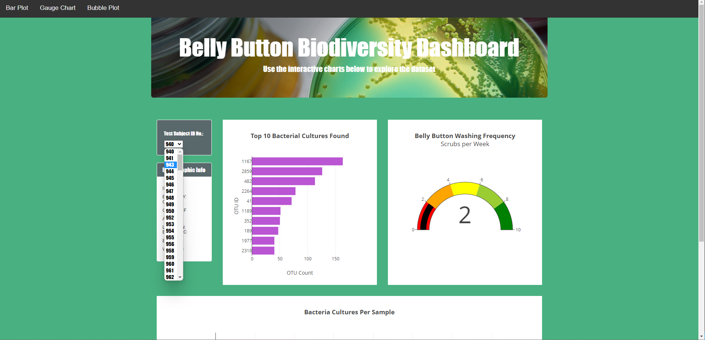
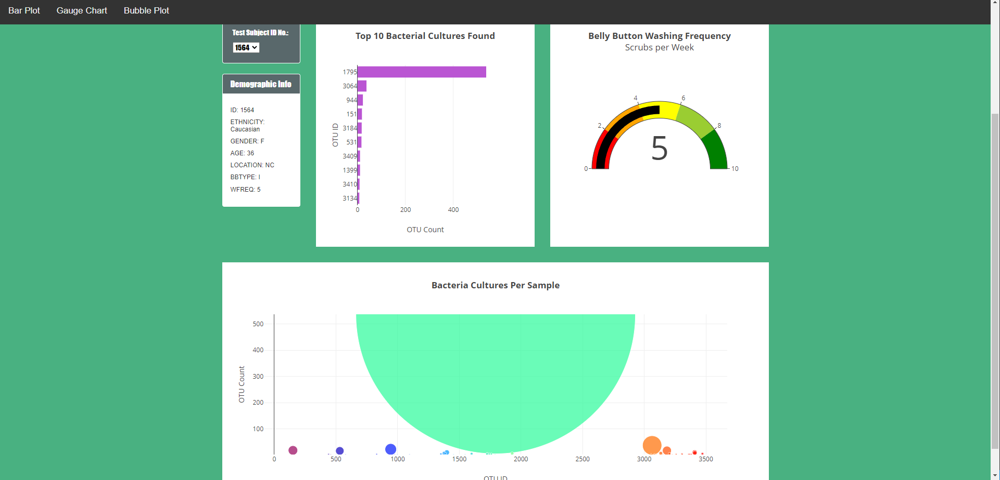

# Belly Button Dashboard
This interactive dashboard was created as part of a mock exercise. The data is part of a mock microbiology study where test subjects had the microbial community composition of their belly buttons analyzed. The Plotly JavaScript library is used to create an interactive data visualization for the web. The resulting web application is deployed through Git Pages and can be found at [https://inregards2pluto.github.io/belly_button_dashboard/]([https://inregards2pluto.github.io/belly_button_dashboard/](https://christinekitchens.github.io/belly-button-dashboard/)).

## How to Use
The webpage will default to showing data from test subject 940.

The webpage shows the demographic information of the test subject (i.e. ID ethnicity, gender, age, location, the type of belly button they have, and the frequency that they was their belly button). The website also shows 3 different data visualizations: A bar chart, a gauge chart, and a bubble plot. The bar chart depicts the top 10 bacterial cultures found in the individual test subject (in operational taxa units). The gauge chart indicates how frequently the subject washes their belly button. Finally, the bubble chart depicts all of the bacterial communities found.

Users can hover their mouse cursor over a data point to see specific information about the bacteria.

To look at the data for a different test subject, click on the dropdown menu above the demographic box. A list of test subjects will appear. Select any one.

After making a new selection, the demographic box and visualizations will automatically update.

